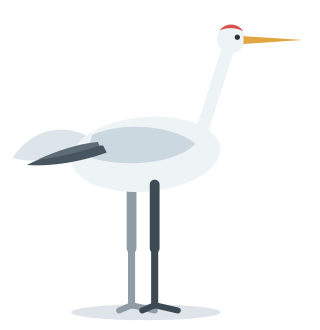

<div align="center">



# Heron

**Compile character animation into a self-contained animated SVG.**
Built so that an agent can write it, look at it, and fix it.

</div>

That crane is not a GIF or a video. It is one 7 kB SVG file with CSS keyframes
inside it, generated from [`examples/crane.ts`](examples/crane.ts). No
JavaScript, no runtime, no external references — it works in an `` tag,
in this README, and offline in ten years.

## Why

Ask a coding agent to make an SVG icon walk and it fails, for two structural
reasons:

1. **No semantics.** The icon is one merged `<path>`. There is no "leg" to
   rotate and nothing says where a joint is. The agent has geometry, not anatomy.
2. **No feedback.** It writes keyframes blind and never sees the result, so it
   cannot tell a walk cycle from a bird having a seizure.

Heron attacks exactly those two things. A character is declared as named parts
with joints, and the CLI lets the agent look at what it made.

## The loop

```bash
heron sheet crane.ts -n 8 -o sheet.png   # eight poses tiled, as one image
heron inspect crane.ts -t 0.3            # the same pose as numbers
heron lint crane.ts                      # defects invisible in a still frame
heron build crane.ts -o crane.svg        # the deliverable
```


A single screenshot cannot tell you whether a walk works, because motion is a
relationship between frames. `sheet` is the command that makes an agent able to
judge its own animation.

`lint` catches what neither stills nor sheets show. These are not style rules;
each one was written because it caught a real defect while building the
reference walk:

```
WARN  [foot-slip] body.legNear.thigh.shin.foot
      planted contact point changes speed, which reads as the foot skating
      speed deviates 656% from the median around t=0.95
```

## Does it actually work for an agent?

That was tested rather than assumed. A fresh agent session was given the library
and `SKILL.md` and nothing else, and asked to animate a character it had never
seen — a gopher, deliberately the opposite body plan to the crane:


It shipped a lint-clean walk in four render-and-look rounds, with every part
compiling exactly. More usefully, it reported what the loop caught that it would
otherwise have shipped blind: a swing foot that never actually left the ground
(the paw sat one unit high, invisible in a still frame), a landing skate, and
artwork that read as a bear cub until it looked at a render.

## Writing a character

Parts have names and joints, and nesting is the rig — a shin declared inside a
thigh moves with it.

```ts
import { character, part, limb, ellipse, walkCycle } from '@heron/core';

export const crane = character('crane',
  { viewBox: [18, 8, 180, 186], duration: 1.1, ground: 183 },
  () => {
    part('body', { pivot: [100, 95] }, () => {
      limb('legFar', { hip: [92, 112], segments: [36, 32], stroke: '#8f9ca6',
                       foot: { toe: [13, 3], heel: [-7, 3] } });
      ellipse({ cx: 100, cy: 95, rx: 42, ry: 21, fill: '#eef3f6' });
      limb('legNear', { hip: [105, 112], segments: [36, 32], stroke: '#3d4a54',
                        foot: { toe: [13, 3], heel: [-7, 3] } });
    });
  });

const gait = walkCycle({ stance: 0.62, reach: 18 });
crane.part('legNear.thigh').animate(gait.thigh);
crane.part('legFar.thigh').animate({ ...gait.thigh, phase: 0.5 });
```

A pivot is the joint's coordinate in the rest pose, written in the same space as
the artwork — which is exactly what `transform-origin` needs, at every depth of
the rig.

## What you can trust

The evaluator (what `snapshot` shows you) and the compiled stylesheet (what the
browser plays) must agree, or the feedback loop is lying. So the animatable
channels are deliberately only what CSS can express — `rotate`, `x`, `y`,
`scaleX`, `scaleY`, `opacity` — and easing is restricted to CSS-expressible
curves.

Measured on the crane: the contact point of the foot, sampled in Node and then
measured again in a browser playing the compiled file, diverges by at most
**0.0064 user units** on a 186-unit-tall figure. That is output rounding, not
drift.

Procedural motion (`sampled()`) cannot be expressed directly, so it is refitted
to sparse keyframes within a bounded error, and `build` always reports which
parts were baked. Nothing is silently degraded.

## Not in scope

No video pipeline, no Lottie export, no preview studio, no interactivity
runtime, no 3D. The output is a plain SVG file, which is the point: if this
project is abandoned tomorrow, every file it ever produced keeps working.

## Status

Working end to end: rig DSL, timeline, compiler, agent CLI, lints, one polished
walk cycle. See [PLAN.md](PLAN.md) for the design and its reasoning.

```bash
node --test test/*.test.ts
node src/cli.ts build examples/crane.ts -o out/crane.svg
```

## Name

TenFore names its projects after animals that live on golf courses. A heron is
the bird that stands in the water hazard — and the icon that would not walk.
(A crane is a different bird; the one in the artwork is the one from the
original failed attempt.)

MIT.
