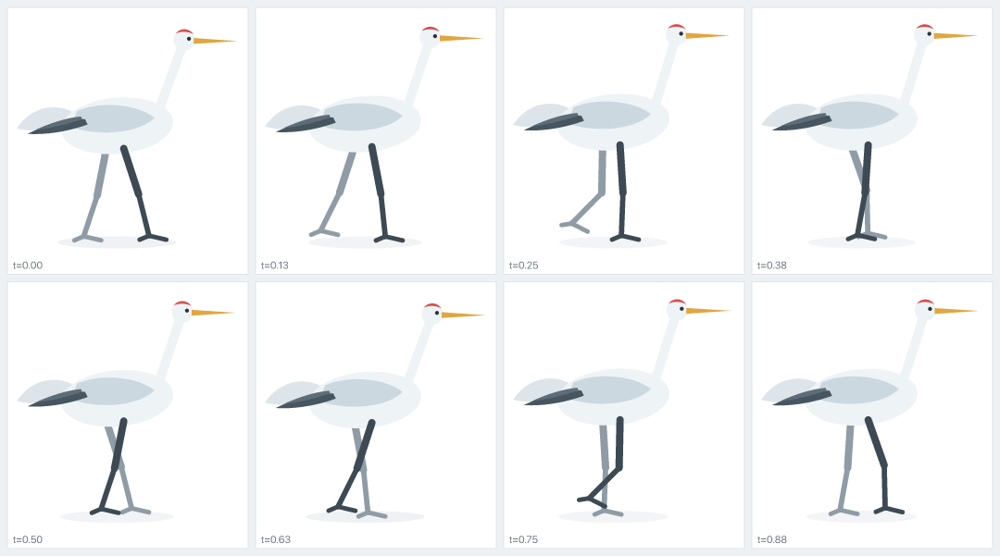
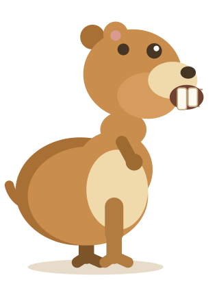
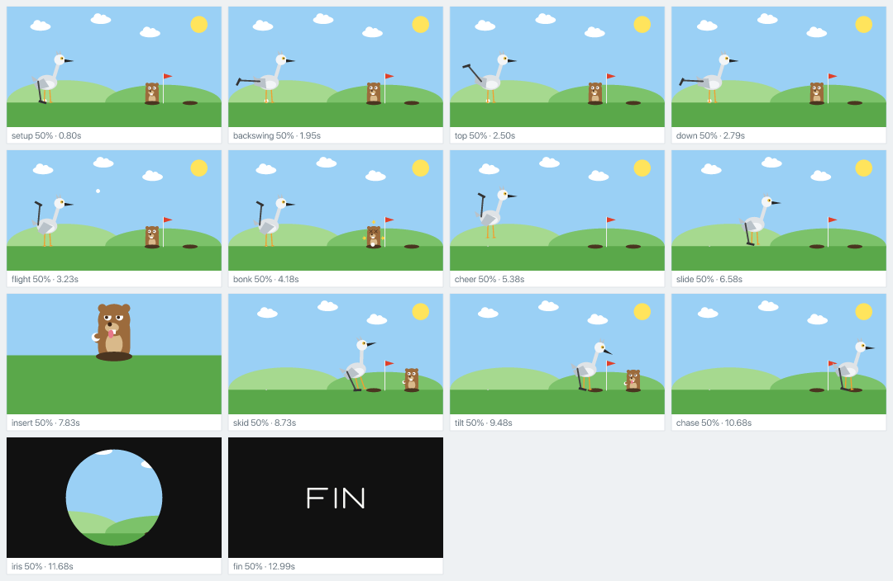

<div align="center">



# Heron

**Compile character animation into a self-contained animated SVG.**
Built so that an agent can write it, look at it, and fix it.

</div>

That pond is not a GIF or a video. It is one 44 kB SVG file with CSS keyframes
inside it, generated from [`examples/heron-fishing.ts`](examples/heron-fishing.ts).
No JavaScript, no runtime, no external references — it works in an `` tag,
in this README, and offline in ten years.

Everything in it is one six-second loop: reeds swaying on staggered phases, two
cloud layers in parallax, a dragonfly hovering on periodic noise, the bird
breathing on its own noise layer. Its eye finds the fish first, the head cocks,
and then `reach()` drives a two-bone neck strike to a point on the water. The
fish flips out with squash-and-stretch, lands with a splash, three ripple rings
spread from a staggered field, and the neck rings back up on an additive
`spring()` layer. Every authored key compiles exactly; only the procedural
noise, IK and spring layers are baked, and the compiler certifies those against
a stated error budget.

## Why

Ask a coding agent to make an SVG icon walk and it fails, for two structural
reasons:

1. **No semantics.** The icon is one merged `<path>`. There is no "leg" to
   rotate and nothing says where a joint is. The agent has geometry, not anatomy.
2. **No feedback.** It writes keyframes blind and never sees the result, so it
   cannot tell a walk cycle from a bird having a seizure.

Heron attacks exactly those two things. A character is declared as named parts
with joints, and the CLI lets the agent look at what it made.

## The loop

```bash
heron import logo.svg -o logo.ts         # preserve existing vector geometry and groups
heron trace logo.png -o logo.ts          # measure raster-only geometry
heron match logo.ts logo.png --json      # prove the rest pose matches its reference
heron shapes crane.ts -o shapes.png      # one cell per run, to see which ink is which part
heron sheet crane.ts -n 8 -o sheet.png   # eight poses tiled, as one image
heron frames crane.ts -o frames --fps 30 # every playback frame, in readable sheet batches
heron motion crane.ts --part legNear.foot # where one part went and how fast
heron variants takes.ts --motion head    # the same scene under several parameters
heron inspect crane.ts -t 0.3            # the same pose as numbers
heron curves crane.ts --json             # every channel's range and several exact instants
heron lint crane.ts                      # defects invisible in a still frame
heron check crane.ts --fps 30 --json     # typecheck + compile + delivery-grid lint
heron build crane.ts -o crane.svg        # the deliverable
heron lottie film.ts -o film.json        # native mobile vector delivery
heron video film.ts -o film.mp4 --fps 30 # optional raster delivery through ffmpeg
```



A single screenshot cannot tell you whether a walk works, because motion is a
relationship between frames. `sheet` is the command that makes an agent able to
judge its own animation.

`motion` goes one level further: it follows a single part and draws where it went,
one dot per sample, because the *spacing* of those dots is how animators have read
timing for a century. On the reference walk the planted foot holds a dead-constant
3.0 units per sample and then travels 5.4x faster through the swing — that contrast
is the walk, and a ratio near 1.0 is a foot skating.

`variants` answers the other kind of question. When a number has no right answer —
how far a neck swings, how high a hop goes — it renders the whole grid of candidates
in one image, with the trajectory drawn in every cell, so the number gets *chosen*
instead of guessed. Every run also writes a JSON sidecar, so a grid can be ranked
numerically as well as looked at.

`lint` catches what neither stills nor sheets show. These are not style rules;
each one was written because it caught a real defect while building the
reference walk:

```
WARN  [foot-slip] body.legNear.thigh.shin.foot
      planted contact point changes speed, which reads as the foot skating
      speed deviates 656% from the median around t=0.95
```

It also reports `INFO` findings that are advisory rather than defects — a contact
point sliding at one speed all cycle, motion that stops dead instead of settling.
Neither can fail a build, and they read the same measurement pass `heron motion`
draws, so a diagnostic and the picture that would show it cannot disagree. One
motion gives one finding however many parts carry it, so a field of fifty
particles driven by one gesture is one line, not fifty.

## Does it actually work for an agent?

That was tested rather than assumed. A fresh agent session was given the library
and `SKILL.md` and nothing else, and asked to animate a character it had never
seen — a gopher, deliberately the opposite body plan to the crane:



It shipped a lint-clean walk in four render-and-look rounds, with every part
compiling exactly. More usefully, it reported what the loop caught that it would
otherwise have shipped blind: a swing foot that never actually left the ground
(the paw sat one unit high, invisible in a still frame), a landing skate, and
artwork that read as a bear cub until it looked at a render.

## A short

The same primitives make a cartoon. *Fore!* is a fourteen-second cutout short
in the paper-and-scissors style: flat fills, no outlines, characters that slide
instead of walking and bob when they talk, mouths that flap with `swap()`, and
hard cuts between a wide shot and a close-up insert.



A crane waggles its club at the tee while a gopher pops up by the flag. Backswing,
a hold at the top, the whoosh; the ball arcs across the fairway and lands on the
gopher's head. X eyes, orbiting stars, and it drops back down the hole. The crane
cheers and slides over to collect. Cut to a close-up: the gopher pops out of a
*different* hole, ball in paw, tongue out. Cut back: the crane skids to a stop,
pauses, tilts its head, "?!", and both slide off screen right. Iris out, FIN.

It is built from [`examples/fore.ts`](examples/fore.ts) as a `score()` of
named beats, and the storyboard below is what `heron sheet --cues` prints from
that score — one labelled frame per beat, which is how the timing was judged:



## Writing a character

Parts have names and joints, and nesting is the rig — a shin declared inside a
thigh moves with it.

```ts
import { character, easeInOut, keys, part, limb, ellipse } from '@heron/core';

export const crane = character('crane',
  { viewBox: [18, 8, 180, 186], duration: 1.1, ground: 183 },
  () => {
    part('body', { pivot: [100, 95] }, () => {
      limb('legFar', { hip: [92, 112], segments: [36, 32], stroke: '#8f9ca6',
                       foot: { toe: [13, 3], heel: [-7, 3] } });
      ellipse({ cx: 100, cy: 95, rx: 42, ry: 21, fill: '#eef3f6' });
      limb('legNear', { hip: [105, 112], segments: [36, 32], stroke: '#3d4a54',
                        foot: { toe: [13, 3], heel: [-7, 3] } });
    });
  });

const thigh = keys([[0, 18, easeInOut], [0.5, -14, easeInOut], [1, 18]]);
crane.part('legNear.thigh').animate({ rotate: thigh });
crane.part('legFar.thigh').animate({ rotate: thigh, phase: 0.5 });
```

A pivot is the joint's coordinate in the rest pose, written in the same space as
the artwork — which is exactly what `transform-origin` needs, at every depth of
the rig.

Parts may also carry a static rest transform without manufacturing constant
animation keys: `part('body', { pivot, transform: { x: 12, rotate: -4 } }, ...)`.
Static transforms participate in world-space inspection and delivery but do not
pollute animation reports.

## Reaching with two-bone IK

Arms and legs can be aimed from the point that matters — where the hand or foot
should land — instead of guessing two joint rotations:

```ts
import { keys, solveTwoBone } from '@heron/core';

const pose = solveTwoBone({
  root: [100, 80],
  target: [155, 205],
  lengths: [72, 66],
  bend: -1, // a downward limb bends toward screen-right
});

figure.part('arm.upper').animate({ rotate: keys([[0, pose.upper], [1, pose.upper]]) });
figure.part('arm.lower').animate({ rotate: keys([[0, pose.lower], [1, pose.lower]]) });
```

The returned angles follow Heron's rig conventions: degrees from a positive-Y
rest pose, with the lower rotation local to the upper part. Targets outside the
limb's reachable range are clamped, and `pose.status` reports `too-close` or
`too-far` rather than silently stretching the bones.

For moving targets, `reach()` evaluates the rig in world space and layers the
solved joint motion over animation already on the character:

```ts
reach(figure, {
  chain: ['arm.upper', 'arm.upper.lower'],
  lengths: [72, 66],
  target: (_t, frame) => frame.point(figure.find('target')!),
  bend: 1,
});
```

## Choreographing a film

`score()` names sequential acting beats. `cueSheet()` names overlapping film
windows in seconds, then places locally authored channels inside them:

```ts
const film = cueSheet(scene, {
  performance: [0, 2.9],
  wipe: [2.7, 4.0],
  signal: [3.9, 7.2],
});

scene.part('wipe').animate({
  scaleX: film.place('wipe', keys([[0, 0], [1, 10]])),
  scaleY: film.place('wipe', keys([[0, 0], [1, 10]])),
});

scene.field('dots').morphThrough([
  { at: 0, points: waveform, opacity: 0 },
  { at: 0.2, points: waveform, opacity: 1, stagger: 0.08 },
  { at: 0.6, points: burst },
  { at: 1, points: logo },
], { window: film.at('signal') });
```

`strokeText()` draws deterministic uppercase vector lettering that can use the
same `draw`, transform and opacity channels as any other part. Custom stroke
fonts are plain geometry created with `strokeFont()`, so typography remains
self-contained rather than depending on fonts installed on the viewer's device.

For a real brand typeface, `loadOutlineFont()` and `outlineText()` convert a
TTF/OTF/WOFF into ordinary filled path geometry at authoring time. The font file
is not referenced by the output:

```ts
const brand = loadOutlineFont('./assets/Brand-Regular.otf');
outlineText('NEXA AI', {
  font: brand, x: 640, y: 560, size: 72, align: 'center', fill: '#fff',
});
```

## Film graphics

Paint resources, clips, masks and compatible path morphs stay inside the same
static/evaluator/compiler pipeline:

```ts
const glow = radialGradient('glow', {
  stops: [
    { at: 0, color: '#72e7ff', opacity: 0.9 },
    { at: 1, color: '#1688ff', opacity: 0 },
  ],
});
const aperture = clipPath('aperture', () =>
  circle({ cx: 640, cy: 360, r: 220, fill: '#fff' }));

part('signal', { clip: aperture }, () => {
  circle({ cx: 640, cy: 360, r: 300, fill: glow });
  path({ d: pathMorph([
    [0, 'M420 360 C520 220 760 220 860 360 C760 500 520 500 420 360 Z'],
    [1, 'M470 250 C650 190 830 330 760 500 C580 550 400 420 470 250 Z'],
  ]), fill: '#fff' });
});
```

`mask()` uses painted luminance or alpha instead of binary clipping. Repeated
translated field/type primitives are automatically serialized as SVG
definitions and `<use>` instances; the authored scene stays expanded and
addressable.

For review, export a `CueSheet` and run:

```bash
heron sheet film.ts --cues -n 3 -o cues.png
heron sheet film.ts --cues=runner,wipe -n 4 -o transition.png
```

Each frame is labelled with cue-local progress and absolute seconds. Overlapping
cues deliberately retain both labels.

For a frame-complete review, `frames` uses the exact same end-exclusive sample
times as video delivery and splits them into sheets that keep each pose readable:

```bash
heron frames film.ts -o out/frames --fps 30 --per-sheet 12
heron frames film.ts -o out/landing --fps 60 --range landing --per-sheet 8
```

`frames.json` maps every frame number and exact time to its sheet, row and
column. Set `--per-sheet 1` when individual full-size frame files are preferable.

## Interchange, Lottie and video

`serializeScene()` produces a versioned JSON-safe scene IR. Authored keys,
resources, rigs and path morphs remain structural; procedural closures are
explicitly sampled because JavaScript functions are not serializable.

```ts
const json = serializeScene(scene, { samples: 256 });
const restored = parseScene(json);
```

For native mobile playback without a WebView, the Lottie backend maps Heron's
part hierarchy, pivots, transform/opacity channels and stroke drawing to
parented vector layers. An exported `Score` or `CueSheet` becomes Lottie
markers. Procedural channels are sampled at the requested playback rate and
thinned to the frames a linear replay needs, within the same error budget the
SVG compiler certifies:

```bash
heron lottie film.ts -o film.json --fps 60 --check
```

The first backend deliberately refuses clips, masks, gradients, path morphs and
skew instead of silently changing their appearance. Static filled/stroked paths,
compound paths, translation/rotation/scale hierarchy, opacity and `draw`/Trim
Paths are supported; this covers character rigs and logo performances such as
`examples/crane-golf.ts`. `--check` uses Skia's independent Skottie player to
rasterize representative frames and compare them with the SVG evaluator; a
failed overlap gate does not write the JSON artifact.

SVG remains the durable browser deliverable. When a commercial also needs
raster media, the optional ffmpeg adapter evaluates exact Heron frames and can
mux a soundtrack:

```bash
heron video film.ts -o film.mp4 -w 1920 --fps 30 --audio soundtrack.wav
```

## What you can trust

The evaluator (what `snapshot` shows you) and the compiled stylesheet (what the
browser plays) must agree, or the feedback loop is lying. So the animatable
channels are deliberately only what CSS can express — `rotate`, `x`, `y`, `skewX`, `skewY`,
`scaleX`, `scaleY`, `opacity`, `draw` — and keyed compatible
path geometry can animate through CSS `d`. Easing is restricted to
CSS-expressible curves.

Measured on the crane: the contact point of the foot, sampled in Node and then
measured again in a browser playing the compiled file, diverges by at most
**0.0064 user units** on a 186-unit-tall figure. That is output rounding, not
drift.

Procedural motion (`sampled()`) cannot be expressed directly, so it is refitted
to sparse keyframes within a bounded error, and `build` always reports which
parts were baked. Nothing is silently degraded.

## Not in scope

No interactivity runtime, simulation-heavy 3D, or bundled physics engine. SVG,
Lottie and video are output adapters, not runtime dependencies of the scene.

## Status

Working end to end: rig DSL, timeline, compiler, agent CLI, lints, Lottie and
video adapters, and the examples above. See [PLAN.md](PLAN.md) for the design
and its reasoning.

```bash
pnpm test                                   # typecheck + unit tests
pnpm examples                               # heron check over every example scene
node src/cli.ts build examples/crane.ts -o out/crane.svg
```

## Name

TenFore names its projects after animals that live on golf courses. A heron is
the bird that stands in the water hazard — and the icon that would not walk.
(A crane is a different bird; the one in the artwork is the one from the
original failed attempt.)

MIT.
